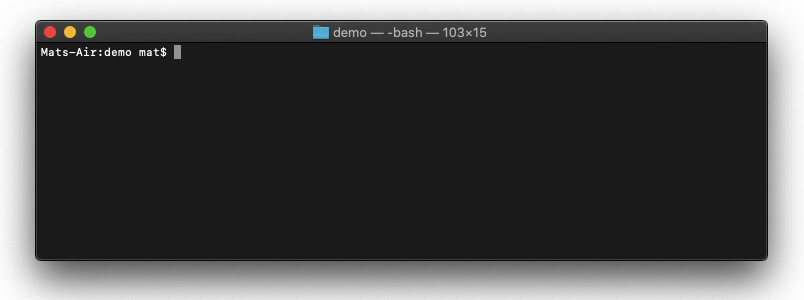

# conventional-commit-helper
[](./LICENSE)


A bash script to assist [conventional commits](https://www.conventionalcommits.org/en/v1.0.0/).

With **conventional-commit-helper**
```bash
$ commit "this is my commit"
```

Behind the scenes
```bash
$ git add .
$ git status
$ git commit -m "TYPE: this is my commit"
```



## Setup
- [x] [Ensure  `PATH=~/bin:$PATH` is in your bash config.](https://unix.stackexchange.com/questions/26047/how-to-correctly-add-a-path-to-path)
- [x] Move the [`commit`](https://github.com/hi-matbub/conventional-commit-helper/blob/main/commit) file to the root of your desired repo.
- [x] [Init (first time only)](https://askubuntu.com/questions/443789/what-does-chmod-x-filename-do-and-how-do-i-use-it)
```bash
$ chmod +x ./commit
```
- [x] **Execute**
```bash
$ ./commit "commit message here"
```
