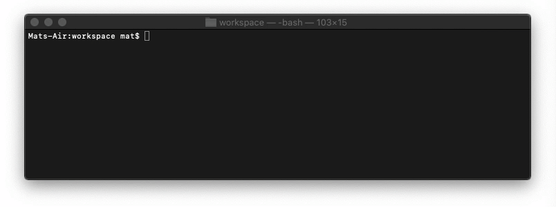
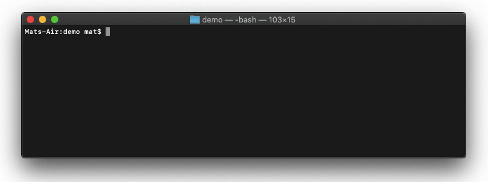

# conventional-commit-helper
[](./LICENSE)


A bash script to assist [conventional commits](https://www.conventionalcommits.org/en/v1.0.0/).

With **conventional-commit-helper**
```bash
$ commit "this is my commit"
```

Behind the scenes
```bash
$ git add .
$ git status
$ git commit -m "TYPE: this is my commit"
```


## Setup
Ensure  `PATH=~/bin:$PATH` is in your bash config. It's _usually_ one of the below file types.

OS | file
--- | ---
Linux | `~/.bashrc`
OSX | `~/.bash_profile`

Clone and move the `commit.sh` file to the root of your desired repo.

Init to execute (first time only)

```bash
$ chmod +x ./path/to/commit.sh
```

#### Video Walkthrough


<details>
  <summary>
    Create an alias in your bash config (optional)
  </summary>
  
</details>
